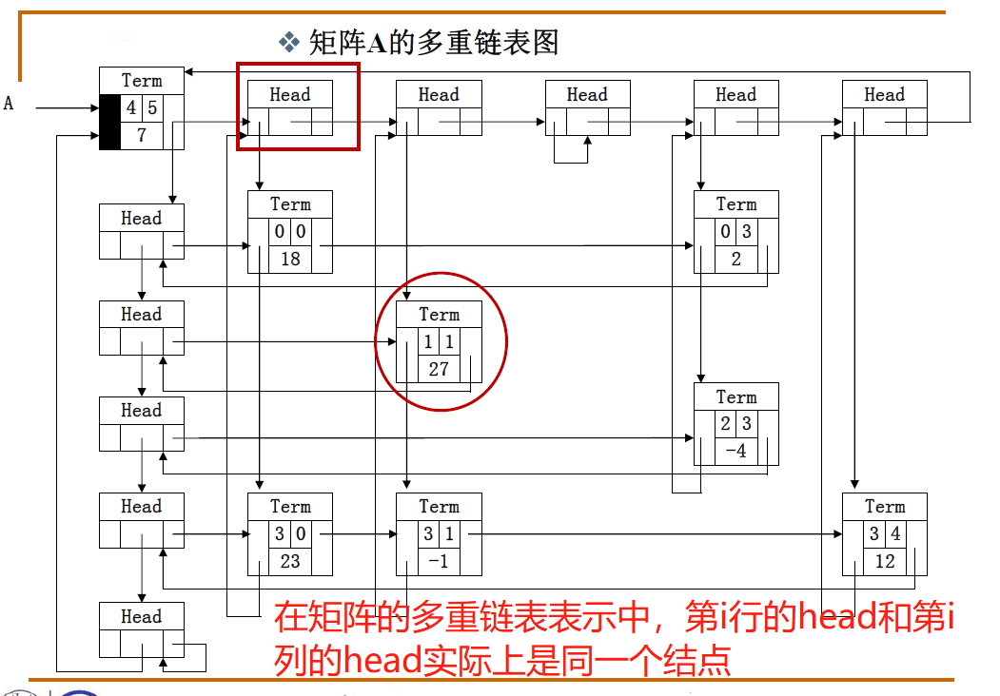

# 线性结构
## 什么是线性表？
多项式表示问题的启示：
1. 同一个问题可以有不同的表示（存储）方式
2. 有一类共性问题：有序线性序列的组织和管理  

“线性表”：由同类型数据元素构成有序序列的线性结构
- 表中元素个数称为线性表的**长度**
- 线性表没有元素时，称为**空表**
- 表起始位置称为**表头**，表结束位置称**表尾**

### 线性表的链式存储实现
- 不要求逻辑上相邻的两个元素物理上也相邻；通过“链”建立起数据元素之间的逻辑关系。
- 插入、删除不需要移动数据元素，只需要修改“链”。

#### 广义表
我们知道了一元多项式的表示，那么二元多项式又该如何表示？  

- 广义表是线性表的推广
- 对于线性表而言，n个元素都是基本的单元素；
- 广义表中，这些元素不仅可以是单元素也可以是另一个广义表。

#### 多重链表
链表中的节点可能同时隶属于多个链
- 多重链表中结点的**指针域会有多个**，如前面例子包含了Next和SubList两个指针域；
- 但包含两个指针域的链表并不一定是多重链表，比如在**双向链表不是多重链表。**
- 多重链表有广泛的用途：基本上如树、图这样相对复杂的数据结构都可以采用多重链表方式实现存储。  
    
   这就是稀疏矩阵用十字链表解决的思路  
  