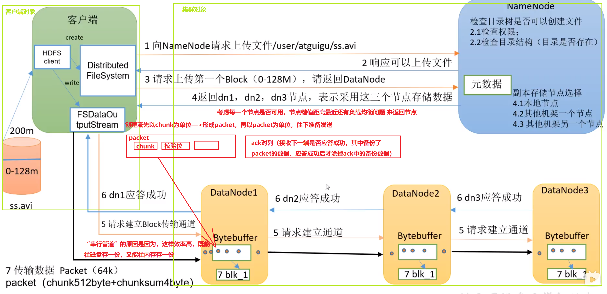
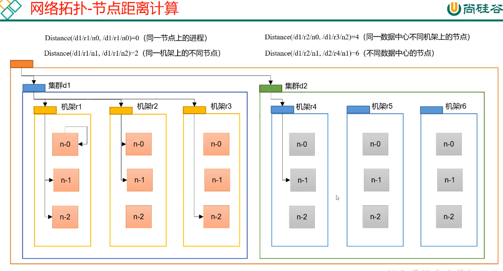
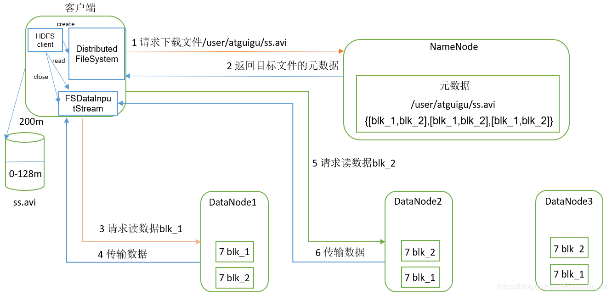
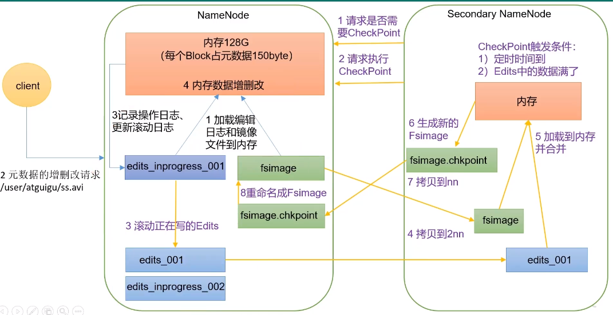
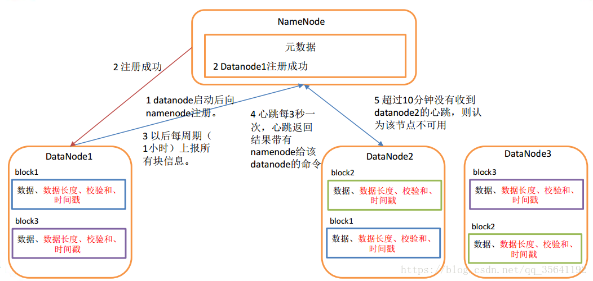
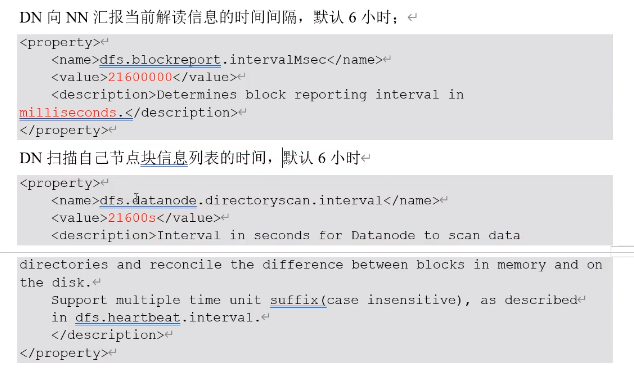
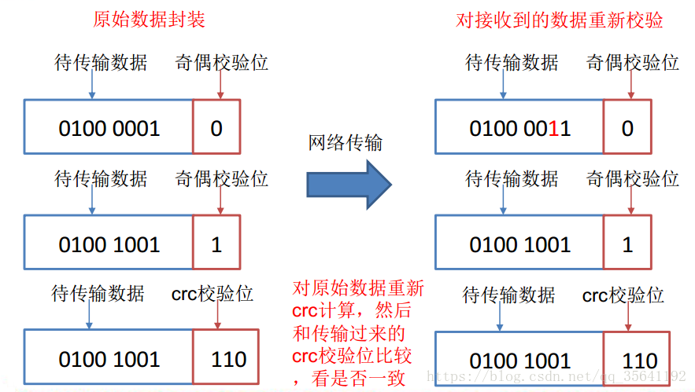

[TOC]


# 第一章 HDFS概述

## 1.1HDFS产出背景及定义

1. HDFS产出背景

   随着数据量越来越大，在一个操作系统存不下所有的数据，那么就分配到更多的操作系统管理的磁盘中，但是不方便管理和维护，迫切需要一种系统来管理多台机器上的文件，这就是分布式文件管理系统。HDFS 只是分布式文件管理系统中的一种。

2. HDFS定义

   HDFS（Hadoop Distributed File System），它是一个文件系统，用于存储文件，通过**目录树**来定位文件；其次，它是分布式的，由很多服务器联合起来实现其功能，**集群中的服务器有各自的角色**。

   HDFS 的使用场景：**适合一次写入，多次读出的场景**。一个文件经过创建、写入和关闭之后就不需要改变。

## 1.2 HDFS优缺点

<u>优点</u>：

1. 高容错性
   1. 数据自动保存多个副本。它通过增加副本的形式，提高容错性。
   2. 某一个副本丢失以后，它可以自动恢复。
2. 适合处理大数据
   1. 数据规模：能够处理数据规模达到GB、TB、甚至**PB**级别的数据。
   2. 文件规模：能够处理**百万**规模以上的**文件数量**，数量相当之大。
3. **可构建在廉价机器上**，通过多副本机制，提高可靠性

<u>缺点</u>：

1. 低时间延迟的访问
   
- 要求低时间延迟的数据访问的应用，不适合在HDFS上运行，比如毫秒级的存储数据。HDFS是提高数据吞吐量的应用优化的，但可能会以提高时间延迟为代价。
  
2. 无法高效的对大量小文件进行存储：

   - 存储大量小文件(这里的小文件是指小于HDFS系统的Block大小的文件（默认64M）)的话，它会占用 NameNode大量的内存来存储文件、目录和块信息。这样是不可取的，因为NameNode的内存总是有限的。
   - 由于namenode将文件系统的元数据存储在内存中，因此文件系统所能存储的文件数量受限制于namenode的内存容量。
   - 小文件存储的寻道时间会超过读取时间，它违反了HDFS的设计目标。

   ```
    NN负责文件元数据(属性，块的映射)的管理，NN在运行时，必须将当前集群中存储所有文件的元数据全部加载到内存！NN耗费大量内存！ 而不能存储可观的数据。
    举例： 当前运行NN的机器，有64G内存，除去系统开销，分配给NN50G内存！
    
    文件a (1k), 存储到HDFS上，需要将a文件的元数据保存到NN，加载到内存
    	包括：文件名  创建时间  所属主  所属组 权限 修改时间+ 块的映射(1块)
    	NN占用内存：150B
    	最多存储50G/150B个文件a
    		存储占用磁盘空间：50G/150B * 1k
    	 
    文件b (128M), 存储到HDFS上，需要将b文件的元数据保存到NN，加载到内存
    		包括：文件名  创建时间  所属主  所属组 权限 修改时间+块的映射(1块)
    	NN占用内存：150B
    	最多存储50G/150B个文件b
    		存储占用磁盘空间：50G/150B * 128M
   
   ```

3. 并发写入，文件随机修改：

   - 一个文件只能有一个写，不允许多个线程同时写。
   - **仅支持数据 append（追加）**，不支持文件的随机修改。

## 1.3HDFS组成架构

1. `NameNode（nn）`：就是Master，它是一个主管、管理者

   1. 管理HDFS的名称空间；
   2. 配置副本策略；
   3. 管理数据块（Block）映射信息；
   4. 处理客户端读写请求。 

2. `DataNode（dn）`：就是Slave(3.x之后叫worker)。NameNode下达命令，DataNode执行实际的操作

   1. 存储实际的数据块；
   2. 执行数据块的读/写操作。

   

   Client：就是客服端

   1. 文件切分：文件上传HDFS的时候，Client将文件切分成一个一个的Block，然后进行上传；
   2. 与NameNode交互，获取文件的位置信息；（允不允许读）
   3. 与DataNode交互，读取或者写入数据；
   4. Client提供一些命令来管理HDFS，比如NameNode格式化；
   5. Client可以通过一些命令来访问HDFS，比如对HDFS增删改查操作。

4. Secondary NameNode：并非NameNode的热备。当NameNode挂掉的时候，它并不能马上替换NameNode并提供服务。

   1. 辅助NameNode，分担其工作。
   2. 但是我们以后都会用2个NameNode来代替，因为NameNode有高可用的特性。

## 1.4HDFS 文件块大小（面试重点）

​	HDFS中的文件再物理上是分块存储（Block），块的大小可以通过配置参数（dfs.blocksize）来规定，**默认大小在Hadoop2.x/3.x版本中是128M,1.X版本中是64M。**  

- 如果寻址时间约为10ms，即查找到目标block的时间为10ms。
- 寻址时间为传输时间的1%时，则为最佳状态。因此，传输时间=10ms/0.01=1000ms=1s
- 而目前磁盘的传输速率普遍为100MB/s（固态硬盘200~300M）
  - <u>因此：普通硬盘的设置成128M</u>
  - <u>固态硬盘块大小可以设置成256M</u>

1. 为什么块的大小不能设置太小，也不能设置太大？

   1. HFDFS的块**设置太小，会增加寻址时间**，程序一直在找块的开始位置；
   2. 如果块设置的**太大**，从**磁盘传输数据的时间**会明显** **。导致程序在处理这块数据时，会非常慢。

   总结：HDFS块的大小设置主要取决于磁盘传输速率。

# 第二章 HDFS的Shell操作（开发重点）

## 2.1 基本语法

hadoop fs 具体命令 OR hdfs dfs 具体命令

两个完全相同

## 2.2 命令大全

```shell
[root@ZKK01 ~]# hadoop fs
2022-01-05 15:11:03,273 WARN util.NativeCodeLoader: Unable to load native-hadoop library for your platform... using builtin-java classes where applicable
Usage: hadoop fs [generic options]
        [-appendToFile <localsrc> ... <dst>]
        [-cat [-ignoreCrc] <src> ...]
        [-checksum [-v] <src> ...]
        [-chgrp [-R] GROUP PATH...]
        [-chmod [-R] <MODE[,MODE]... | OCTALMODE> PATH...]
        [-chown [-R] [OWNER][:[GROUP]] PATH...]
        [-concat <target path> <src path> <src path> ...]
        [-copyFromLocal [-f] [-p] [-l] [-d] [-t <thread count>] <localsrc> ... <dst>]
        [-copyToLocal [-f] [-p] [-ignoreCrc] [-crc] <src> ... <localdst>]
        [-count [-q] [-h] [-v] [-t [<storage type>]] [-u] [-x] [-e] [-s] <path> ...]
        [-cp [-f] [-p | -p[topax]] [-d] <src> ... <dst>]
        [-createSnapshot <snapshotDir> [<snapshotName>]]
        [-deleteSnapshot <snapshotDir> <snapshotName>]
        [-df [-h] [<path> ...]]
        [-du [-s] [-h] [-v] [-x] <path> ...]
        [-expunge [-immediate] [-fs <path>]]
        [-find <path> ... <expression> ...]
        [-get [-f] [-p] [-ignoreCrc] [-crc] <src> ... <localdst>]
        [-getfacl [-R] <path>]
        [-getfattr [-R] {-n name | -d} [-e en] <path>]
        [-getmerge [-nl] [-skip-empty-file] <src> <localdst>]
        [-head <file>]
        [-help [cmd ...]]
        [-ls [-C] [-d] [-h] [-q] [-R] [-t] [-S] [-r] [-u] [-e] [<path> ...]]
        [-mkdir [-p] <path> ...]
        [-moveFromLocal [-f] [-p] [-l] [-d] <localsrc> ... <dst>]
        [-moveToLocal <src> <localdst>]
        [-mv <src> ... <dst>]
        [-put [-f] [-p] [-l] [-d] [-t <thread count>] <localsrc> ... <dst>]
        [-renameSnapshot <snapshotDir> <oldName> <newName>]
        [-rm [-f] [-r|-R] [-skipTrash] [-safely] <src> ...]
        [-rmdir [--ignore-fail-on-non-empty] <dir> ...]
        [-setfacl [-R] [{-b|-k} {-m|-x <acl_spec>} <path>]|[--set <acl_spec> <path>]]
        [-setfattr {-n name [-v value] | -x name} <path>]
        [-setrep [-R] [-w] <rep> <path> ...]
        [-stat [format] <path> ...]
        [-tail [-f] [-s <sleep interval>] <file>]
        [-test -[defswrz] <path>]
        [-text [-ignoreCrc] <src> ...]
        [-touch [-a] [-m] [-t TIMESTAMP (yyyyMMdd:HHmmss) ] [-c] <path> ...]
        [-touchz <path> ...]
        [-truncate [-w] <length> <path> ...]
        [-usage [cmd ...]]
```

## 2.3 常用实操命令

### 2.3.1 准备工作

1. 启动Hadoop集群（方便后续测试）

```shell
[root@ZKK01 hadoop-3.3.1]# sbin/start-all.sh
```

2. -help：输出这个命令参数的帮助，也可以去百度

```shell
[root@ZKK01 hadoop-3.3.1]# hadoop fs -help rm
```

3. 创建/sanguo文件夹

```shell
[root@ZKK01 hadoop-3.3.1]# hadoop fs -mkdir /sanguo
```

### 2.3.2 上传

1. -moveFromLocal 从本地<u>剪切</u>粘贴到HDFS

   ```shell
   [root@ZKK01 hadoop-3.3.1]# vim shuguo.txt
   输入： shuguo
   [root@ZKK01 hadoop-3.3.1]# hadoop fs -moveFromLocal ./shuguo.txt /sanguo
   ```

2. -copyFromLocal 从本地文件系统拷贝文件到HDFS路径去

3. -put 等同于copyFromLocal，生产环境更习惯用put

   ```shell
   hadoop fs -put ./wuguo.txt /sanguo
   ```

4. -appendToFile 追加一个文件到已经存在的文件末尾

   ```shell
   vim liubei.txt
   输入： liubei
   
   hadoop fs -appendToFile liubei.txt /sanguo/shuguo.txt
   ```

### 2.3.3 下载

1. -copyToLocal：从HDFS拷贝到本地

2. -get：等同于copyToLocal，生产环境更习惯用get

   ```shell
   hadoop fs -get /sanguo/shuguo.txt ./shuguo2.txt
   ```

### 2.3.4 HDFS 直接操作

1. -ls： 显示目录信息

   ```shell
   hadoop fs -ls /sanguo
   ```

2. -cat：显示文件内容

   ```shell
   hadoop fs -cat /sanguo/shuguo.txt
   ```

3. -chgrp、-chmod、-chown：Linux文件系统中的用法一样，修改文件所属权限

   ```shell
   hadoop fs -chmod 666 /sanguo/shuguo.txt
   hadoop fs -chmod ZKK01:ZKK01 /sanguo/shuguo.txt
   ```

4. -mkdir：创建路径

   ```shell
   hadoop fs -mkdir /jinguo
   ```

5. -cp：从HDFS的一个路径拷贝到HDFS的另一个路径

   ```shell
   hadoop fs -cp /sanguo/shuguo.txt /jinguo
   ```

6. -mv：在HDFS目录中移动文件

   ```shell
   hadoop fs -mv /sanguo/wuguo.txt /jinguo
   hadoop fs -mv /sanguo/weiguo.txt /jinguo
   ```

7. -tail：显示一个文件的末尾1kb的数据

   ```shell
   hadoop fs -tail /jinguo/shuguo.txt
   ```

8. -rm：删除文件或文件夹

   ```shell
   hadoop -rm /sanguo/shuguo.txt
   ```

9. -rm -r：递归删除目录及目录里面的内容

   ```shell
   hadoop fs -rm -r /sanguo
   ```

10. -du：统计文件夹的大小信息

    ```shell
    hadoop fs -du -s -h /jinguo #只列出文件夹总大小
    hadoop fs -du -h /jinguo	#文件夹内内容详细信息
    ```

11. -setrep：设置HDFS中文件的副本数量

    ```shell
    hadoop fs -setrep 10 /jinguo/shuguo.txt
    ```

    

    

    这里设置的副本数只是记录在NameNode的元数据中，是否真的会有这么多副本，还得看DataNode的数量。因为目前只有3台设备，最多也就3个副本，只有节点数的增加到10台时，副本数才能达到10。

# 第三章 HDFS的API操作

## 3.1客户端环境准备

1. windows去：https://github.com/kontext-tech/winutils 下载对应版本的编译好的bin文件替换原来安装在windows里的hadoop文件的bin

2. 将bin文件里的hadoop.dll粘贴到system32里
3. 创建maven项目导入相关相关依赖

## 3.2HDFS-API相关操作

> github上我仓库的hadoopLearning :<https://github.com/AirlandKK/hadoopLearning>  

# 第四章 HDFS的读写流程（面试重点）

## 4.1 HDFS写数据流程

### 4.1.1 剖析文件写入



1、客户端通过Distributed FileSystem模块向namenode请求上传文件到/user/atguigu/ss.avi这个路径文件

2、校验文件是否存在，如果存在就会报目录存在这个错误，如果不存在则相应可以上传文件

3、客户端请求第一个Block（0-128M）上传到那几个DataNode服务器上

4、返回dn1，dn2，dn3节点，表示这三个节点可以存储数据（通过负载量和距离来选择dn）

5、客户端通过调用FSDataOutPutStream模块请求dn1上传数据，dn1收到请求会继续调用dn2，然后dn2调用dn3，将这个通信          管道建立完成。

6、dn1、dn2、dn3逐级应答客户端。

7、客户端开始往dn1上传第一个Block（先从磁盘读取数据放到一个本地内存缓存），以Packet为单位，dn1收到一个Packet就          会传给dn2，dn2传给dn3；dn1每传一个packet会放入一个应答队列等待应答。

      当一个Block传输完成之后，客户端再次请求NameNode上传第二个Block的服务器。（重复执行3-7步）。

8、告诉namenode传输完成

### 4.1.2 网络拓扑-节点距离计算

​	在HDFS写数据的过程中，NameNode会选择距离待上传数据最近距离的DataNode接收数据。那么这个最近距离怎么计算呢？  

​	**节点距离：两个节点到达最近的共同祖先的距离总和。**

把n当作服务器，把机架r看作交换机，把d看作机房，把最外面看作互联网，一条线计为1



### 4.1.3 机架感知（副本存储节点选择）

1. 机架感知说明 

   - > 官网说明：https://hadoop.apache.org/docs/stable/hadoop-project-dist/hadoop-hdfs/HdfsDesign.html
     >
     > For the common case, when the replication factor is three, HDFS’s placement policy is to put **one replica <u>on the local</u> machine** if the writer is on a datanode, otherwise on a random datanode in the same rack as that of the writer, **another replica on a node in a <u>different (remote) rack</u>, and the last on a different node in the <u>same remote</u> rack.** This policy cuts the inter-rack write traffic which generally improves write performance. The chance of rack failure is far less than that of node failure; this policy does not impact data reliability and availability guarantees. However, it does not reduce the aggregate network bandwidth used when reading data since a block is placed in only two unique racks rather than three. With this policy, the replicas of a block do not evenly distribute across the racks. Two replicas are on different nodes of one rack and the remaining replica is on a node of one of the other racks. This policy improves write performance without compromising data reliability or read performance.

   - 第一个副本在Client所处的节点上。如果客户端在集群外，随机选一个，第二个副本在另一个机架的随机一个节点，第三个副本在第二个副本所在机架的随即节点。（<u>保持可靠性兼顾效率</u>）

2. 源码说明

   - Crtl+n 查找BlockPlacementPolicyDefault，在该类中chooseTargetInOrder方法。


## 4.2 HDFS读数据流程



1、客户端通过Distributed FileSystem（客户端对象）向NameNode请求下载文件，创建一个FSDataInputStream（流对象）。（<u>Namenode要判断该请求是否有权限、文件是否存在</u>）

2、NameNode通过查询元数据，找到文件块所在的DataNode地址，返回目标文件的元数据。

3、挑选一台DataNode（就近原则，然后随机）服务器，请求读取数据。（<u>判断节点距离、也会判断负载均衡</u>）

4、DataNode开始传输数据给客户端（从磁盘里面读取数据输入流，以Packet为单位来做校验）。

5、客户端以Packet为单位接收，先在本地缓存，然后写入目标文件。

6、最后会关闭资源

> PS ：HDFS的读的方式都是**串行读**！只能串行读！为了保证每一个任务的传输效率，且追求稳定可靠


# 第五章 NameNode和SecondaryNameNode

## 5.1 NN和2NN的关系

```
内存：
	好处：计算快
	坏处：可靠性差
磁盘：
	好处：可靠性高
	坏处：计算慢

内存+磁盘=》效率低
		fsImage 存储数据（如果是随机读写效率 a=10 a+10=>a=20）
		对历史数据的改写效率很低，
		但是可以追加
		Edits追加=>a+10 a-30 a*20 （只记录过程）
		
		
fsImage存储数据+Edits追加=内存  (2NN可以帮助这两个文件定期进行合并)
```


工作机制图：



1 第一阶段： namenode 启动
1）第一次启动 namenode 格式化后， 创建 fsimage 和 edits 文件。如果不是第一次启动，直接加载编辑日志和镜像文件到内存。
2） 客户端对元数据进行增删改的请求。
3） namenode 记录操作日志，更新滚动日志。
4） namenode 在内存中对数据进行增删改查。

2 第二阶段： Secondary NameNode 工作
1） Secondary NameNode 询问 namenode 是否需要 checkpoint。 直接带回 namenode 是否检查结果。
2） Secondary NameNode 请求执行 checkpoint。
3） namenode 滚动正在写的 edits 日志。
4）将滚动前的编辑日志和镜像文件拷贝到 Secondary NameNode。
5） Secondary NameNode 加载编辑日志和镜像文件到内存，并合并。
6） 生成新的镜像文件 fsimage.chkpoint。
7） 拷贝 fsimage.chkpoint 到 namenode。
8） namenode 将 fsimage.chkpoint 重新命名成 fsimage。

> ps：定时时间默认1小时，Edits数据满了默认100万条

**NN和2NN工作机制详解：**

```
Fsimage：namenode内存中元数据序列化后形成的文件。 
Edits：记录客户端更新元数据信息的每一步操作（可通过Edits运算出元数据）。 
namenode启动时，先滚动edits并生成一个空的edits.inprogress，然后加载edits和fsimage到内存中，此时namenode内存就持有最新的元数据信息。client开始对namenode发送元数据的增删改查的请求，这些请求的操作首先会被记录的edits.inprogress中（查询元数据的操作不会被记录在edits中，因为查询操作不会更改元数据信息），如果此时namenode挂掉，重启后会从edits中读取元数据的信息。然后，namenode会在内存中执行元数据的增删改查的操作。 
由于edits中记录的操作会越来越多，edits文件会越来越大，导致namenode在启动加载edits时会很慢，所以需要对edits和fsimage进行合并（所谓合并，就是将edits和fsimage加载到内存中，照着edits中的操作一步步执行，最终形成新的fsimage）。secondarynamenode的作用就是帮助namenode进行edits和fsimage的合并工作。 
secondarynamenode首先会询问namenode是否需要checkpoint（触发checkpoint需要满足两个条件中的任意一个，定时时间到和edits中数据写满了）。直接带回namenode是否检查结果。secondarynamenode执行checkpoint操作，首先会让namenode滚动edits并生成一个空的edits.inprogress，滚动edits的目的是给edits打个标记，以后所有新的操作都写入edits.inprogress，其他未合并的edits和fsimage会拷贝到secondarynamenode的本地，然后将拷贝的edits和fsimage加载到内存中进行合并，生成fsimage.chkpoint，然后将fsimage.chkpoint拷贝给namenode，重命名为fsimage后替换掉原来的fsimage。namenode在启动时就只需要加载之前未合并的edits和fsimage即可，因为合并过的edits中的元数据信息已经被记录在fsimage中。
```


## 5.2 Fsimage（镜像文件）和Edits（编辑日志）解析

- 概念

NameNode被格式化之后，将在/hadoop-3.1.3/data/tmp/dfs/name/current目录中产生如下文件

```shell
[root@ZKK01 current]# ll
total 1044
-rw-r--r-- 1 root root     640 Jan  6 21:18 edits_0000000000000000001-0000000000000000009
-rw-r--r-- 1 root root 1048576 Jan  6 21:18 edits_inprogress_0000000000000000010
-rw-r--r-- 1 root root     399 Jan  6 21:01 fsimage_0000000000000000000
-rw-r--r-- 1 root root      62 Jan  6 21:01 fsimage_0000000000000000000.md5
-rw-r--r-- 1 root root       3 Jan  6 21:18 seen_txid
-rw-r--r-- 1 root root     215 Jan  6 21:01 VERSION
```

1. Fsimage文件：HDFS文件系统元数据的一个**永久性的检查点**，其中包含HDFS文件系统的所有目录和文件inode的序列化信息
2. Edits文件：存放HDFS文件系统的所有更新操作的路径，文件系统客户端执行的所有写操作首先会被记录到Edits文件中。
3. seen_txid文件保存的是一个数字，就是最后一个edits_的数字
4. 每次NameNode启动的时候都会将fsimage文件读入内存，加载edits里面的更新操作，保证内存中的元数据信息是最新的、同步的，可以看成NameNode启动的时候就将fsimage和edits文件进行了合并。


- oiv查看fsimage文件

  - 查看oiv和oev命令 

    ```shell
    [root@ZKK01 current]# hdfs
    oiv               apply the offline fsimage viewer to an fsimage
    oev               apply the offline edits viewer to an edits file
    ```

  - 基本语法

    ```sehll
    hdfs oiv -p 文件类型 -i镜像文件 -o 转换后文件输出路径  
    ```

  - 举个例子

    ```
    [root@ZKK01 current]# pwd
    /opt/software/hadoop-3.3.1/data/tmp/dfs/name/current
    [root@ZKK01 current]# hdfs oiv -p XML -i fsimage_0000000000000000000 -o /opt/software/hadoop-3.3.1/fsimage.xml
    2022-01-14 13:39:03,374 INFO offlineImageViewer.FSImageHandler: Loading 2 strings
    2022-01-14 13:39:03,546 INFO namenode.FSDirectory: GLOBAL serial map: bits=29 maxEntries=536870911
    2022-01-14 13:39:03,546 INFO namenode.FSDirectory: USER serial map: bits=24 maxEntries=16777215
    2022-01-14 13:39:03,546 INFO namenode.FSDirectory: GROUP serial map: bits=24 maxEntries=16777215
    2022-01-14 13:39:03,546 INFO namenode.FSDirectory: XATTR serial map: bits=24 maxEntries=16777215
    [root@ZKK01 current]# cat /opt/software/hadoop-3.3.1/fsimage.xml 
    ```

  - 命令：sz 文件名 可以存到windows

    ```shell
    [root@ZKK01 current]# sz /opt/software/hadoop-3.3.1/fsimage.xml 
    ```

- oev查看edits文件

  - 基本语法

    ```shell
    hdfs oev -p 文件类型 -i编辑日志 -o 转换后文件输出路径
    ```

  - 举个例子

    ```shell
    [root@ZKK01 current]# hdfs oev -p XML -i edits_0000000000000000001-0000000000000000009 -o /opt/software/hadoop-3.3.1/edits.xml
    ```

- 思考namenode怎么确定下次合并那些edits？

  - 将大于fsimage最后序号的edits文件合并

## 5.3 CheckPoint时间设置

1. 通常情况下，SecondaryNameNode每隔一小时执行一次。 

   [hdfs-default.xml]

   ```xml
   <property>
     <name>dfs.namenode.checkpoint.period</name>
     <value>3600</value>
   </property >
   ```

2. 一分钟检查一次操作次数，当操作次数达到1百万时，SecondaryNameNode执行一次。

   ```xml
   <property>
     <name>dfs.namenode.checkpoint.txns</name>
     <value>1000000</value>
   <description>操作动作次数</description>
   </property>
   
   <property>
     <name>dfs.namenode.checkpoint.check.period</name>
     <value>60</value>
   <description> 1分钟检查一次操作次数</description>
   </property >
   ```


# 第六章 DataNode

## 6.1 DataNode 工作机制



1. 一个数据块在 datanode 上以文件形式存储在磁盘上，包括两个文件，一个是数据本身，一个是元数据包括数据块的长度，块数据的校验和，以及时间戳。

2. DataNode 启动后向 namenode 注册， 通过后，周期性（6小时） 的向 namenode 上报所有的块信息。

   

3. 心跳是每 3 秒一次，心跳返回结果带有 namenode 给该 datanode 的命令如复制块数据到另一台机器，或删除某个数据块。 如果超过 10 分钟没有收到某个 datanode 的心跳，则认为该节点不可用。

4. 集群运行中可以安全加入和退出一些机器。
   

## 6.2 数据完整性

1. 当DataNode读取block的时候，它会计算checksum校验和

2. 如果计算后的checksum，与block创建时值不一样，说明block已经损坏。

3. client读取其他DataNode上的block.

4. 常见的校验算法crc(32),md5(128),shal(160)

5. datanode在其文件创建后周期验证checksum校验和
   



## 6.3 掉线时限参数设置

1、DataNode进程死亡或者网络故障造成DataNode无法与NameNode通信;
2、NameNode不会立即把该节点判定为死亡，要经过一段时间，这段时间暂称作超时时长;
3、HDFS默认的超时时长为10分钟+30秒;
4、如果定义超时时间为TimeOut，则超时时长的计算公式为：

```shell
TimeOut = 2 * dfs.namenode.heartbeat.recheck-interval + 10 * dfs.heartbeat.interval
```

而默认的dfs.namenode.heartbeat.recheck-interval 大小为5分钟，dfs.heartbeat.interval默认为3秒。需要注意的是 hdfs-site.xml 配置文件中的heartbeat.recheck.interval 的单位为**毫秒**，dfs.heartbeat.interval 的单位为**秒**。

```xml
<property>
 <name>dfs.namenode.heartbeat.recheck-interval</name>
 <value>300000</value>
</property>
<property>
 <name>dfs.heartbeat.interval</name>
 <value>3</value>
</property>

```


# 总结

1. HDFS文件块大小
   - 硬盘读写速度
   - 在企业中 一般128m（中小公司） 256m（大公司）
2. HDFS的Shell操作（开发重点）
3. HDFS的读写流程