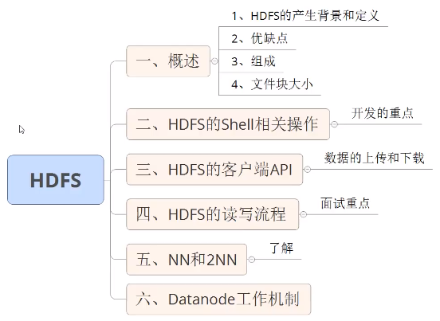
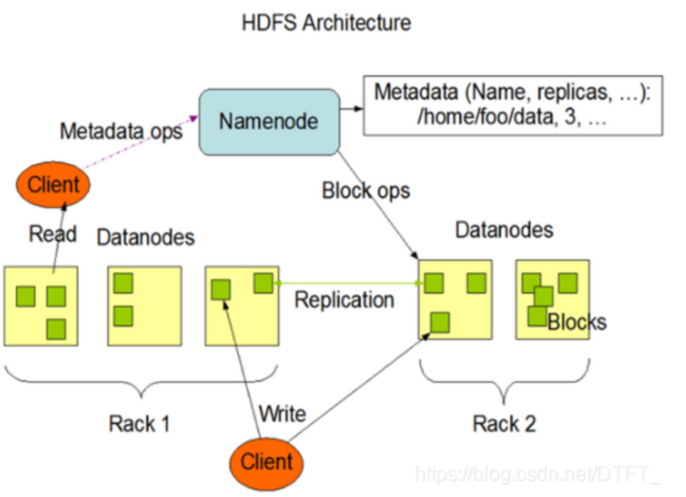

# 第一章 HDFS概述

## 1.1HDFS产出背景及定义

1. HDFS产出背景

   随着数据量越来越大，在一个操作系统存不下所有的数据，那么就分配到更多的操作系统管理的磁盘中，但是不方便管理和维护，迫切需要一种系统来管理多台机器上的文件，这就是分布式文件管理系统。HDFS 只是分布式文件管理系统中的一种。

2. HDFS定义

   HDFS（Hadoop Distributed File System），它是一个文件系统，用于存储文件，通过**目录树**来定位文件；其次，它是分布式的，由很多服务器联合起来实现其功能，**集群中的服务器有各自的角色**。

   HDFS 的使用场景：**适合一次写入，多次读出的场景**。一个文件经过创建、写入和关闭之后就不需要改变。

## 1.2 HDFS优缺点

<u>优点</u>：

1. 高容错性
   1. 数据自动保存多个副本。它通过增加副本的形式，提高容错性。
   2. 某一个副本丢失以后，它可以自动恢复。
2. 适合处理大数据
   1. 数据规模：能够处理数据规模达到GB、TB、甚至**PB**级别的数据。
   2. 文件规模：能够处理**百万**规模以上的**文件数量**，数量相当之大。
3. **可构建在廉价机器上**，通过多副本机制，提高可靠性

<u>缺点</u>：

1. 低时间延迟的访问
   - 要求低时间延迟的数据访问的应用，不适合在HDFS上运行，比如毫秒级的存储数据。HDFS是提高数据吞吐量的应用优化的，但可能会以提高时间延迟为代价。

2. 无法高效的对大量小文件进行存储：

   - 存储大量小文件(这里的小文件是指小于HDFS系统的Block大小的文件（默认64M）)的话，它会占用 NameNode大量的内存来存储文件、目录和块信息。这样是不可取的，因为NameNode的内存总是有限的。
   - 由于namenode将文件系统的元数据存储在内存中，因此文件系统所能存储的文件数量受限制于namenode的内存容量。
   - 小文件存储的寻道时间会超过读取时间，它违反了HDFS的设计目标。

   ```
    NN负责文件元数据(属性，块的映射)的管理，NN在运行时，必须将当前集群中存储所有文件的元数据全部加载到内存！NN耗费大量内存！ 而不能存储可观的数据。
    举例： 当前运行NN的机器，有64G内存，除去系统开销，分配给NN50G内存！
    
    文件a (1k), 存储到HDFS上，需要将a文件的元数据保存到NN，加载到内存
    	包括：文件名  创建时间  所属主  所属组 权限 修改时间+ 块的映射(1块)
    	NN占用内存：150B
    	最多存储50G/150B个文件a
    		存储占用磁盘空间：50G/150B * 1k
    	 
    文件b (128M), 存储到HDFS上，需要将b文件的元数据保存到NN，加载到内存
    		包括：文件名  创建时间  所属主  所属组 权限 修改时间+块的映射(1块)
    	NN占用内存：150B
    	最多存储50G/150B个文件b
    		存储占用磁盘空间：50G/150B * 128M
   
   ```

3. 并发写入，文件随机修改：

   - 一个文件只能有一个写，不允许多个线程同时写。
   - **仅支持数据 append（追加）**，不支持文件的随机修改。

## 1.3HDFS组成架构

1. `NameNode（nn）`：就是Master，它是一个主管、管理者

   1. 管理HDFS的名称空间；
   2. 配置副本策略；
   3. 管理数据块（Block）映射信息；
   4. 处理客户端读写请求。 

2. `DataNode（dn）`：就是Slave(3.x之后叫worker)。NameNode下达命令，DataNode执行实际的操作

   1. 存储实际的数据块；
   2. 执行数据块的读/写操作。

   

3. Client：就是客服端

   1. 文件切分：文件上传HDFS的时候，Client将文件切分成一个一个的Block，然后进行上传；
   2. 与NameNode交互，获取文件的位置信息；（允不允许读）
   3. 与DataNode交互，读取或者写入数据；
   4. Client提供一些命令来管理HDFS，比如NameNode格式化；
   5. Client可以通过一些命令来访问HDFS，比如对HDFS增删改查操作。

4. Secondary NameNode：并非NameNode的热备。当NameNode挂掉的时候，它并不能马上替换NameNode并提供服务。

   1. 辅助NameNode，分担其工作。
   2. 但是我们以后都会用2个NameNode来代替，因为NameNode有高可用的特性。

