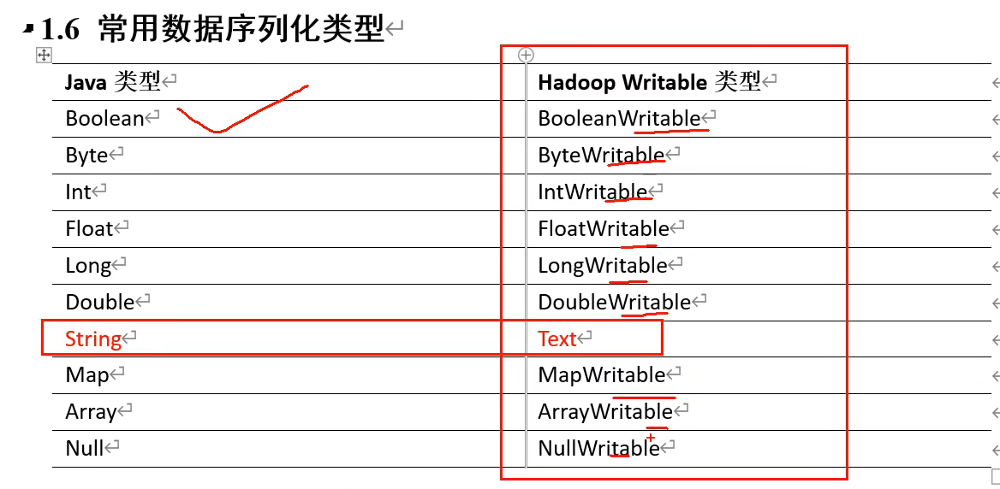
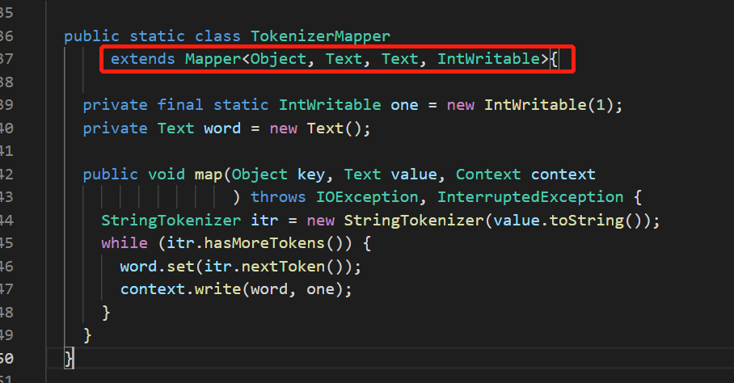
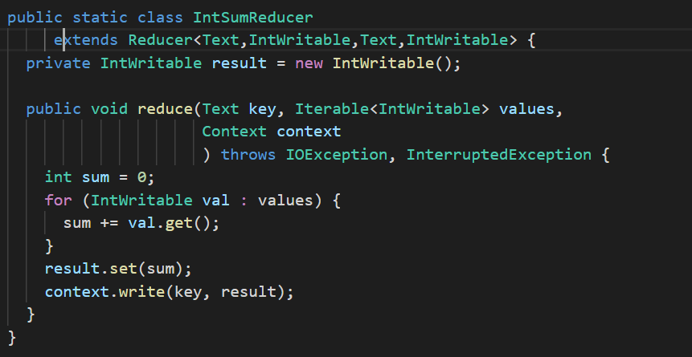
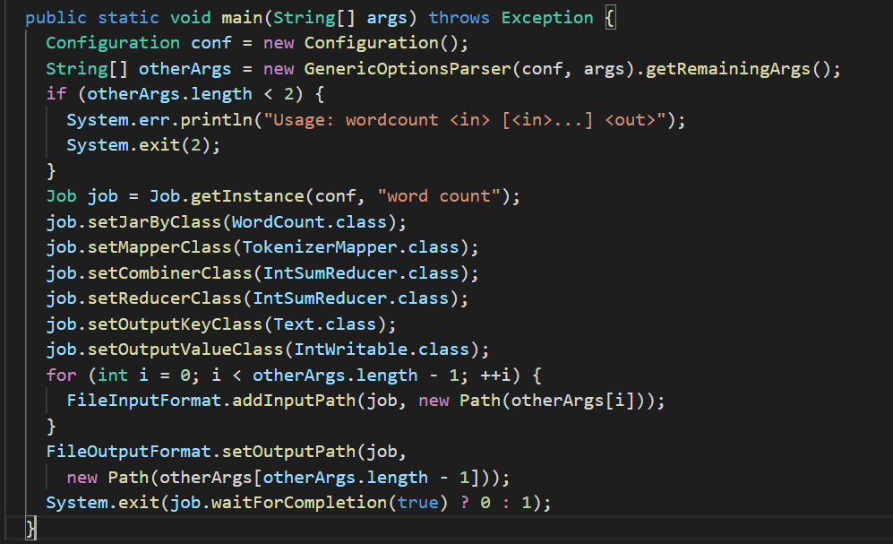
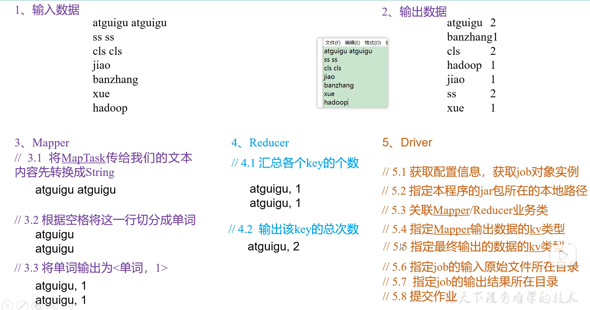

[toc]

# 第一章 MapReduce概述

## 1.1 MapReduce 定义

​	MapReduce是一个**分布式运算程序**的编程框架，是用户开发“基于Hadoop的数据分析应用“的核心框架。

​	MapReduce核心功能是将**用户编写的业务逻辑代码**和**自带默认组件**整合成一个完整的**分布式运算程序**，并发运行在一个Hadoop集群上。

## 1.2 MapReduce 优缺点

### 1.2.1 优点

1. MapReduce 易于编程 。用户只关心，业务逻辑。实现框架接口。
2. 良好的扩展性：可以动态增加服务器，解决计算资源不够的问题。
3. 高容错性。任何一台机器挂掉，可以将任务转移到其他节点。
4. 适合海量数据计算（TB/PB）几千台服务器共同计算。

### 1.2.2 缺点

1. 不擅长实时计算。Mysql
2. 不擅长流式计算。sark flink
3. 不擅长DAG有向无环图计算。spark -rdd 迭代时计算

# 1.3 MapReduce 核心思想

1. MapReduce运算程序一般需要分为2个阶段：Map阶段和Reduce阶段
2. Map阶段的并发MapTask，完全并行运行，互不相干
   - 读数据，并按行处理
   - 按空格切分行内单词
   - KV键值对（单词，1）
   - 将所有的KV键值对中的单词，按照单词首字母，分成2个分区溢写到磁盘
3. Reduce阶段的并发ReduceTask，完全互不相干，但是他们的数据依赖于上一个阶段的所有MapTask并发实例的输出
   - 统计map阶段分组好的单词，输出数据（输出结果到文件）
4. MapReduce编程模型只能包含一个Map阶段和一个Reduce阶段，如果用户的业务逻辑非常复杂，那就只能多个MapReduce程序，串行运行。


**若干问题细节**

1. MapTask如何工作
2. ReduceTask如何工作
3. MapTask如何控制分区、排序等
4. MapTask和ReduceTask之间如何衔接

# 1.4 MapReduce进程

一个完整的MapReduce程序在分布式运行时有三类实例进程：

1. **MrAppMaster**（任务、job、mr）：负责整个程序的过程调度及状态协调。
2. **MapTask**(查不到，因为叫yarnchild)：负责Map阶段的整个数据处理流程。
3. **ReduceTask**(查不到，因为叫yarnchild)：负责Reduce阶段的整个数据处理流程。


# 1.5 官方WordCount源码

https://github.com/apache/hadoop

查看wordcount方法

https://github1s.com/apache/hadoop/blob/66b72406bd8bed28ca32c75e07fc2b682500e92b/hadoop-mapreduce-project/hadoop-mapreduce-examples/src/main/java/org/apache/hadoop/examples/WordCount.java


# 1.6 常用数据序列化类型



# 1.7 编程规范

用户编写的程序分为三个部分：Mapper、Reducer和Driver

## 1. Mapper阶段

1. 用户自定义的Mapper要继承自己的父类

2. Mapper的输入是KV对的形式（KV的类型可自定义）

3. Mapper中的业务逻辑卸载map()方法汇总

4. Mapper的输出数据是KV对的形式（KV的类型可自定义）

5. **map（）方法（MapTask进程）对每一个<k,v>调用一次**

   

## 2.Reducer阶段

1. 用户自定义的Reducer要继承自己的父类

2. Reducer的输入数据类型对应Mapper的输出数据类型，也是KV

3. Reducer的业务逻辑卸载reduce()方法中

4. ReduceTask进程对**每一组相同k**的<k,v>组调用一次reduce()方法

   

## 3. Driver阶段

相当于YARN集群的客户端，封装了MapReducer相关运行参数的job对象



# 代码阶段



```xml
    <build>
        <plugins>
            <!-- 配置当前项目的jdk版本信息 -->
            <plugin>
                <!-- 不包含其他依赖的打包，所以很小 -->
                <groupId>org.apache.maven.plugins</groupId>
                <artifactId>maven-compiler-plugin</artifactId>
                <version>3.8.1</version>
                <configuration>
                    <source>11</source>
                    <target>11</target>
                    <encoding>UTF-8</encoding>
                </configuration>
            </plugin>
            <plugin>
                 <!-- 包含其他依赖的打包 -->
                <groupId>org.apache.maven.plugins</groupId>
                <artifactId>maven-assembly-plugin</artifactId>
                <version>3.3.0</version>
                <configuration>
                    <!-- 配置描述符文件 -->
                    <!--                    <descriptor>src/main/assembly/assembly.xml</descriptor>-->
                    <!-- 也可以使用Maven预配置的描述符-->
                    <descriptorRefs>
                        <descriptorRef>jar-with-dependencies</descriptorRef>
                    </descriptorRefs>
                </configuration>
                <executions>
                    <execution>
                        <id>make-assembly</id>
                        <!-- 绑定到package生命周期 -->
                        <phase>package</phase>
                        <goals>
                            <!-- 只运行一次 -->
                            <goal>single</goal>
                        </goals>
                    </execution>
                </executions>
            </plugin>
        </plugins>
    </build>
```


