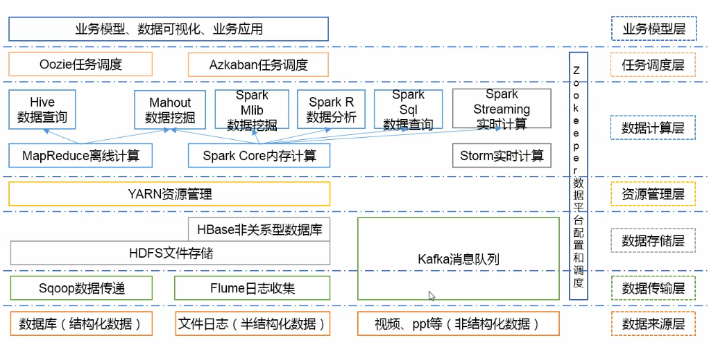
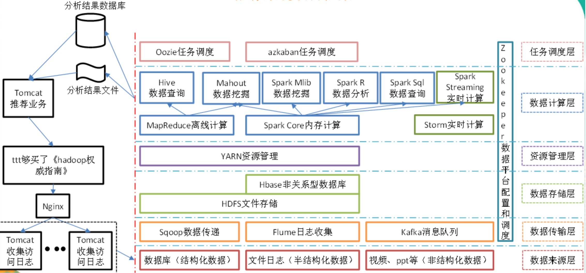

# Hadoop1.x和Hadoop2.x区别

- Hadoop1.x组成
  - MapReduce（计算+资源调度）
  - HDFS（数据存储）
  - Common（辅助工具）    
- Hdoop2.x组成
  - MapReduce（计算）
  - **Yarn（资源调度）**
  - HDFS（数据存储）
  - Common（辅助工具）

在Hadoop1.X时代，Hadoop中的MapRudece同时处理业务逻辑运算和资源的调度，耦合性较大，在Hadoop2.X时代，增加了Yarn。Yarn只负责资源的调度，MapReduce只负责运算。  

# HDFS架构概述

- **NameNode（nn）**-类似目录：存储文件的元数据，如文件名，文件目录结构，文件属性（生成时间、副本数、文件权限），以及每个文件的块列表和块所在的DataNode等。
- **DataNode（dn）**-类似真正存储的数据：在本地文件系统存储文件块数据，以及块数据的校验和。
- Secondary NameNode（2nn）：用来监控HDFS状态的辅助后台程序，每隔一段时间获取HDFS元数据的快照。

# YARN架构概述

1. **ResourceManager（RM）主要作用如下**
   1. 处理客户端请求
   2. 监控NodeManager
   3. 启动或监控ApplicationMaster
   4. 资源的分配与调度
2. **NodeManager（NM）主要作用如下**
   1. 管理单个节点上的资源
   2. 处理来自ResourceManager的命令
   3. 处理来自ApplicationMaster的命令
3. ApplicationMaster（AM）作用如下
   1. 负责数据的切分
   2. 为应用程序申请资源并分配给内部的任务
   3. 任务的监控与容错
4. Container
   1. Container是YARN中资源抽象，它封住了某个节点上的多维度资源，如内存、CPU、磁盘、网络等。

# MapRudece架构概述

MapReduce将计算过程分为两个阶段：Map和Reduce

1. Map阶段并行处理输入数据
2. Reduce阶段对Map结果进行汇总

# 大数据技术生态系统

| 数据来源层                  | 数据传输层    | 数据存储层                           | 资源管理层   | 数据计算层                                                   | 任务调度层 | 配置和调度 | 业务模型层 |
| --------------------------- | ------------- | ------------------------------------ | ------------ | ------------ | ------------ | ------------ | ------------ |
| 数据库（结构化数据）        | Sqoop数据传递 | **HDFS文件存储**                     | YARN资源管理 | MapReduce<u>离线</u>计算（1. **Hive数据查询**（javaEE）、2. Mahout数据挖掘（算法）） | Oozie任务调度、Azkaban任务调度 | Zookeeper（容易改变的配置信息） | 业务模型、数据库可视化、业务应用 |
| 文件日志（半结构化数据）    | Flume日志收集 | **HDFS文件存储**/HBase非关系型数据库 | YARN资源管理 | Spark Core内存计算 （<u>离线</u>1. Spark Mlib数据挖掘、2.Spark R数据分析、3.Spark Sql数据查询；<u>准实时批处理</u>Spark Streaming实时计算）/Flink 流处理 | Oozie任务调度、Azkaban任务调度 | Zookeeper（容易改变的配置信息） | 业务模型、数据库可视化、业务应用 |
| 视频、ppt等（非结构化数据） | Kafka消息队列 | Kafka缓存一些数据                    |              |||Zookeeper（容易改变的配置信息）|业务模型、数据库可视化、业务应用|

# 推荐系统项目框架

