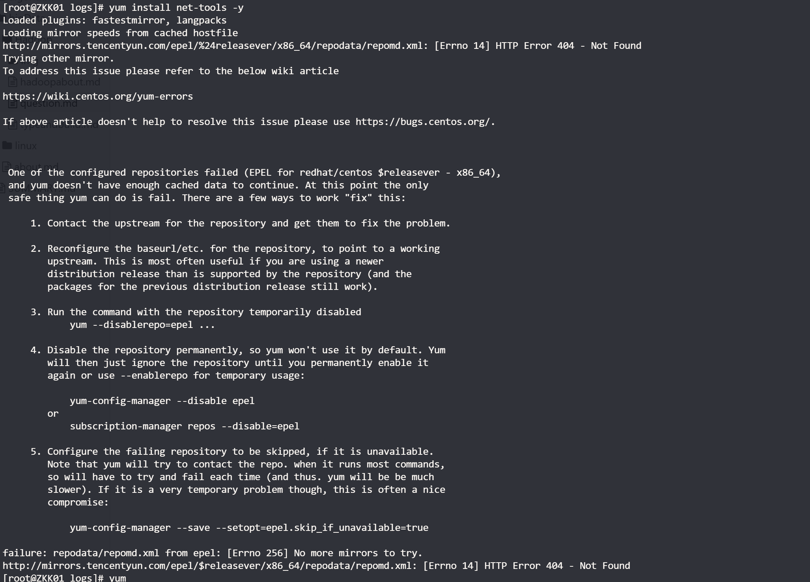
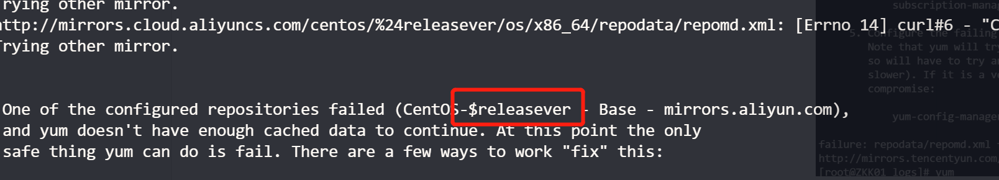
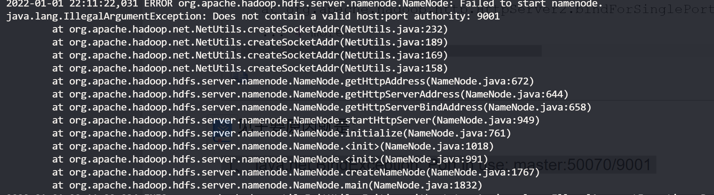
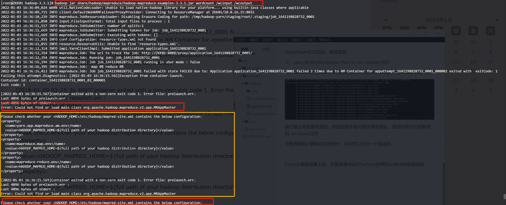

#### 1.用公司电脑ssh服务器，突然连接不上了（之前可以）


ssh -v root@110.42.160.28 ,报错信息如下

```shell
C:\02_projects\myGit\learning>ssh -v root@110.42.160.28                                                                                                  
OpenSSH_for_Windows_8.1p1, LibreSSL 3.0.2
debug1: Connecting to 110.42.160.28 [110.42.160.28] port 22.
debug1: connect to address 110.42.160.28 port 22: Connection refused
ssh: connect to host 110.42.160.28 port 22: Connection refused
```

用VNC登录，显示**Failed to start OpenSSH server deamon**

接着输入sshd -t 检查：显示Missing privilege separation directory: /var/empty/sshd

解决办法：创建一个目录/var/empty/sshd

```shell
mkdir /var/empty
mkdir /var/empty/sshd
sshd -t
#重启sshd
systemctl restart sshd
```


后能成功登录

#### 2. 伪分布式群起失败。


解决方法:

可以把/home/hadoop/.ssh/known_hosts文件删了，然后重新生成配对密钥即可

```shell
sudo apt-get openssh-server
```

```shell
ssh-keygen -t rsa -P ""
```

```shell
cat $HOME/.ssh/id_rsa.pub >> $HOME/.ssh/authorized_keys
```

[ssh连接所生成的known_hosts出现的问题](https://blog.csdn.net/weixin_30619101/article/details/96996016?spm=1001.2101.3001.6661.1&utm_medium=distribute.pc_relevant_t0.none-task-blog-2%7Edefault%7ECTRLIST%7Edefault-1.no_search_link&depth_1-utm_source=distribute.pc_relevant_t0.none-task-blog-2%7Edefault%7ECTRLIST%7Edefault-1.no_search_link&utm_relevant_index=1)

####  3. 解决云服务器重启后，hostname还原的问题

```text
查看主机名：hostname
修改主机名：
方法1：sudo hostname xxx 
             但是这是临时的，重启后失效
方法2 ：修改hostname文件，永久修改
              sudo vi /etc/hostname
              重启系统后才会生效
但是，在云服务器上，用方法2设置后，重启后还是会将hostname还原为之前的
需要在在 /etc/cloud/cloud.cfg中将cloud_init_modules中的下面两行删除
-set_hostname
- [update_hostname,once-per-instance]
```

linux centos yum报错 To address this issue please refer to the below wiki article 解决方法



报错原因：国外[yum](https://so.csdn.net/so/search?q=yum)镜像源 国内下载不了 修改为国内阿里yum镜像源

解决方法：

```bash
cd /etc/yum.repos.d/
mkdir repo_bak
mv *.repo repo_bak/
wget http://mirrors.aliyun.com/repo/Centos-7.repo
yum clean all
yum makecache
```

详细参考：《[centos7](https://so.csdn.net/so/search?q=centos7) 配置国内yum源和epel源》https://blog.csdn.net/whatday/article/details/106107168

解析不不了配置文件中的$releasever



```shell
vim Centos-7.repo
vim CentOS-Base.repo
#用vim的查找替换命令 将$releasever都替换为7（因为我的是centos7）
%s/\$releasever/7/g
```

#### 4.Vim 字符串替换

查找和替换是任意一款文本编辑器的一组常见和必备功能。下面就来讲解 Vim 中的字符串替换功能。

Vim 使用以下命令结构实现替换功能。

```
:<range> s/<search_string>/<replace_string>/<modifier>
```

- range - 定义执行“查找和替换”函数的范围，有两个不同的值
  - ％ - 对整个文件执行
  - < start _line > < end_line > - 在一组特定的行上面执行操作
- search_string - 需要替换的字符串
- replace_string - 替换旧字符串的新字符串
- modifier - 确定替换行为，有几个不同的值
  - g - 全局替换
  - gc - 在每次更换之前要求确认
  - gn - 忽略替换功能并突出显示查找结果。


#### 5.NameNode无法启动，报错原因：

 1、 java.net.BindException: Port in use: master:9001

 2、Caused by: java.net.BindException: Cannot assign requested address



端口被占用是直接原因，但起因是不能分配所需的地址，跟地址有关的就联想到 /etc/hosts文件

云服务器的IP要换成内网的IP，内网可以比作一个局域网。 


#### 6.hadoop集群部署上后，在服务器中运行hadoop自带的jar包中的实例报错



解决方法：按错误提示，在mapred-site.xml配置文件中添加hadoop根目录

1.先运行hadoop classpath得到classpath

将得到的classpath全部复制到mapred-site.xml中，配置

```xml
<property> 
    <name>mapreduce.application.classpath</name>    <value>/home/hadoop/app/hadoop/etc/hadoop:/home/hadoop/app/hadoop/share/hadoop/common/lib/*:/home/hadoop/app/hadoop/share/hadoop/common/*:/home/hadoop/app/hadoop/share/hadoop/hdfs:/home/hadoop/app/hadoop/share/hadoop/hdfs/lib/*:/home/hadoop/app/hadoop/share/hadoop/hdfs/*:/home/hadoop/app/hadoop/share/hadoop/mapreduce/*:/home/hadoop/app/hadoop/share/hadoop/yarn:/home/hadoop/app/hadoop/share/hadoop/yarn/lib/*:/home/hadoop/app/hadoop/share/hadoop/yarn/*
</value>
</property>

```

配置结束关闭mapred-site.xml

重新启动集群，再在share文件中运行        

#### 7. WARNING: REMOTE HOST IDENTIFICATION HAS CHANGED!  

报错如下

```
@@@@@@@@@@@@@@@@@@@@@@@@@@@@@@@@@@@@@@@@@@@@@@@@@@@@@@@@@@@
ZKK01: @    WARNING: REMOTE HOST IDENTIFICATION HAS CHANGED!     @
ZKK01: @@@@@@@@@@@@@@@@@@@@@@@@@@@@@@@@@@@@@@@@@@@@@@@@@@@@@@@@@@@
ZKK01: IT IS POSSIBLE THAT SOMEONE IS DOING SOMETHING NASTY!
ZKK01: Someone could be eavesdropping on you right now (man-in-the-middle attack)!
ZKK01: It is also possible that a host key has just been changed.
ZKK01: The fingerprint for the ECDSA key sent by the remote host is
...
```

**原因：**

因为服务器的ip发生变更了
第一次SSH连接时，会生成一个认证，储存在客户端（也就是用SSH连线其他电脑的那个，自己操作的那个）中的known_hosts，但是如果服务器验证过了，认证资讯当然也会更改，服务器端与客户端不同时，就会跳出错误啦。

**解决办法：**

```shell
输入命令：ssh-keygen -R +输入服务器的IP
```

#### 8.Permission denied (publickey,gssapi-keyex,gssapi-with-mic,password)问题解决

经过排查发现是没有设置免密登录，解决方案如下：

```shell
ssh-keygen -t rsa
cat ~/.ssh/id_rsa.pub >> ~/.ssh/authorized_keys
chmod 0600 ~/.ssh/authorized_keys
```