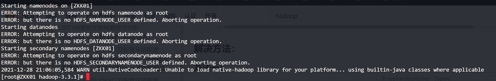

# 单机模式 stonealone

- grep案例
- WordCount案例


# 伪分布式模式

- 所有配置都是按照分布式来的
- 但是只有一台服务器


# 虚拟机环境准备

```shell
vim /etc/udev/rules.d/70-persistent-net.rules //修改最后为eth0
vim /etc/sysconfig/network-scripts/ifcfg-eth0 

```

https://juejin.cn/post/6991352348471722014#heading-18

https://juejin.cn/post/6844904114980126734#heading-1

```shell
# 设置环境变量
$ vim /etc/profile
# 进入之后在文件末尾追加如下内容：
#java
export JAVA_HOME=/usr/lib/jvm/java-1.8.0-openjdk
export JRE_HOME=${JAVA_HOME}/jre    
export CLASSPATH=.:${JAVA_HOME}/lib:${JRE_HOME}/lib    
export PATH=${JAVA_HOME}/bin:$PATH
#hadoop
export HADOOP_HOME=/opt/software/hadoop-3.3.1
export PATH=$PATH:$HADOOP_HOME/bin
export PATH=$PATH:$HADOOP_HOME/sbin
export HADOOP_MAPRED_HOME=$HADOOP_HOME
export HADOOP_COMMON_HOME=$HADOOP_HOME
export HADOOP_HDFS_HOME=$HADOOP_HOME
export YARN_HOME=$HADOOP_HOME
export HADOOP_COMMON_LIB_NATIVE_DIR=$HADOOP_HOME/lib/native
export HADOOP_OPTS="-Djava.library.path=$HADOOP_HOME/lib"
export JAVA_LIBRARY_PATH=$HADOOP_HOME/lib/native:$JAVA_LIBRARY_PATH
# 使环境变量生效
$ source /etc/profile

	<property>
        <name>hadoop.tmp.dir</name>
        <value>/opt/software/hadoop-3.3.1/data/tmp</value>
    </property>
```

# 配置免密登录

#### 1.编辑/etc/hosts

(下面的 IPn 表示如 192.168.1.1 格式的云服务器外网 IP 地址。注意，如果是指向本机的 IP，请用内网 IP 地址代替)

```XML
IP1 ZKK01
IP2 slave1
IP3 slave2
```

#### 2.切换到hadoop用户生成id_rsa.pub(我是root用户所以不用切换和赋权)

```shell
su hadoop
cd ~
ssh-keygen -t rsa
cd ~/.ssh/
cat id_rsa.pub >> authorized_keys
#chmod 700 /home/hadoop/.ssh
#chmod 644 /home/hadoop/.ssh/authorized_keys
```

---**以上命令所有云服务器都要运行**---

#### 3.交换共享 id_rsa.pub 的内容

（如果搭建伪分布模式，则可以略过交换共享这一步，直接进行 ssh 的测试）--我就是伪分布式

##### 1) master 云服务器操作

```
scp /home/hadoop/.ssh/authorized_keys slave2:/home/hadoop/.ssh/
```

##### (2) slave1 云服务器操作

```
scp /home/hadoop/.ssh/authorized_keys slave3:/home/hadoop/.ssh/
```

##### (3) slave2 云服务器操作

```
scp /home/hadoop/.ssh/authorized_keys master:/home/hadoop/.ssh/
```

- 这一步的最终目的是让所有云服务器的 **authorized_keys** 内容都包含各自的 **id_rsa.pub** 信息，且内容相同。

##### (4) 测试配置是否成功

###### master 上执行命令：

```
ssh slave1
quit
ssh slave2
quit
```

###### slave1 上执行命令：

```
ssh master
quit
ssh slave2
quit
```

###### slave2 上执行命令：

```
ssh master
quit
ssh slave1
quit
```

- 需要确保所有云服务器能够相互 `ssh` 通过。
- 第一次进行 `ssh` 需要密码登录。输完密码之后，选择 `yes` 保存记录。之后就不再需要输入密码登录了。
- 如果出现异常情况，可重启服务再尝试：`sudo service sshd service`。

# 修改配置文件

#### 1. /etc/profile 配置环境变量

```shell
vim /opt/software/hadoop-3.3.1/etc/profile
```


```XML
#java
export JAVA_HOME=/usr/lib/jvm/java-1.8.0-openjdk
export JRE_HOME=${JAVA_HOME}/jre
export CLASSPATH=.:${JAVA_HOME}/lib:${JRE_HOME}/lib
export PATH=${JAVA_HOME}/bin:$PATH
#hadoop
export HADOOP_HOME=/opt/software/hadoop-3.3.1
export PATH=$PATH:$HADOOP_HOME/bin
export PATH=$PATH:$HADOOP_HOME/sbin
export HADOOP_MAPRED_HOME=$HADOOP_HOME
export HADOOP_COMMON_HOME=$HADOOP_HOME
export HADOOP_HDFS_HOME=$HADOOP_HOME
export YARN_HOME=$HADOOP_HOME
export HADOOP_COMMON_LIB_NATIVE_DIR=$HADOOP_HOME/lib/native
export HADOOP_OPTS="-Djava.library.path=$HADOOP_HOME/lib"
export JAVA_LIBRARY_PATH=$HADOOP_HOME/lib/native:$JAVA_LIBRARY_PATH
```

#### 2. 使环境变量生效

```she'l
source /etc/profile
```

# 集群配置


也可以都配置在同一台机子上如果内存够的话..

四个默认核心文件

四个自定义文件：

```shell
#配置路径
/opt/software/hadoop-3.3.1/etc/hadoop
```

- 配置core-site.xml

```xml
<?xml version="1.0" encoding="UTF-8"?>
<?xml-stylesheet type="text/xsl" href="configuration.xsl"?>

<!-- Put site-specific property overrides in this file. -->

<configuration>
    <!--指定HDFS中NameNode的地址-->
    <property>
        <name>fs.defaultFS</name>
        <value>hdfs://ZKK01:8020</value>
		<!-- 除了8020 还有9000等 -->
    </property>
    <!--指定Hadoop运行时产生文件的存储目录-->
    <property>
        <name>hadoop.tmp.dir</name>
        <value>/opt/software/hadoop-3.3.1/data/tmp</value>
    </property>
    <!--配置HDFS网页登录使用的静态用户为zkk，可以不配置-->
     <property>
        <name>hadoop.http.staticuser.user</name>
        <value>zkk</value>
    </property>
</configuration>

```

- 配置hdfs-site.xml

```xml
<?xml version="1.0" encoding="UTF-8"?>
<?xml-stylesheet type="text/xsl" href="configuration.xsl"?>

<configuration>
    <!-- nn web端访问地址 -->
    <property>
        <name>dfs.namenode.http-address</name>
        <value>ZKK01:9870</value>
    </property>
    <!-- 指定HDFS副本的数量 -->
    <property>
        <name>dfs.replication</name>
        <value>1</value>
    </property>
    <!-- 2nn web端访问地址 -->
    <property>
        <name>dfs.namenode.secondary.http-address</name>
        <value>ZKK01:9870</value>
    </property>
</configuration>
```

- 配置yarn-site.xml

```xml
<configuration>
    <!-- 指定MR走shuffle-->
	<property>
		<name>yarn.nodemanager.aux-services</name>
		<value>mapreduce_shuffle</value>
	</property>
    
    <!--指定ResourceManager地址-->
    <property>
		<name>yarn.resourcemanager.address</name>
		<value>ZKK01</value>
	</property>

    <!--环境变量的继承-->
    <!--3.1.3以上的版本解决了这个bug可以不配置-->
</configuration>
```

- 配置mapred-site.xml

```xml
<configuration>
    <!--指定MapReduce程序运行在Yarn上-->
    <property>
        <name>mapreduce.framework.name</name>
		<value>yarn</value>
	</property>
</configuration>
```

# 群起集群

## 1. 配置Works 

```shell
vim /opt/software/hadoop-3.3.1/etc/hadoop/workers
```

```xml
#默认为local 把local注释掉
ZKK01
```

## 2. 启动集群

1. **如果集群是第一次启动**，需要在ZKK01节点格式化NameNode（注意：格式化NameNode，会产生新的集群id，导致NameNode和DataNode的集群id不一致，集群找不到以往数据。如果集群在运行中报错，需要重新格式化NameNode的话，一定要先停止namenode和datanode进程，并且要删除所有机器的data和logs目录，然后再进行格式化）

```shell
[root@ZKK01 hadoop-3.3.1]# hdfs namenode -format
```

2. 启动HDFS

```shell
[root@ZKK01 hadoop-3.3.1]# sbin/start-dfs.sh
```

/opt/software/hadoop-3.3.1/data/tmp/dfs/name/current       


- 启动过程中遇到报错（**root权限问题?**）



解决办法：

- 方法一：

  在Hadoop安装目录下找到sbin文件夹

  在里面修改四个文件

  1、对于start-dfs.sh和stop-dfs.sh文件，添加下列参数：

  ```xml
  #!/usr/bin/env bash
  HDFS_DATANODE_USER=root
  HADOOP_SECURE_DN_USER=hdfs
  HDFS_NAMENODE_USER=root
  HDFS_SECONDARYNAMENODE_USER=root
  ```

  2、对于start-yarn.sh和stop-yarn.sh文件，添加下列参数：

  ```shell
  #!/usr/bin/env bash
  YARN_RESOURCEMANAGER_USER=root
  HADOOP_SECURE_DN_USER=yarn
  YARN_NODEMANAGER_USER=root
  
  ```

  重新开始start…就可以。

- 方法二（推荐采用）

  

  - ```shell
    cd /etc/hadoop/
    vim hadoop-env.sh
    ```

  - ```xml
    export HDFS_NAMENODE_USER=root
    export HDFS_DATANODE_USER=root
    export HDFS_SECONDARYNAMENODE_USER=root
    export YARN_RESOURCEMANAGER_USER=root
    export YARN_NODEMANAGER_USER=root
    
    ```

  - Now save and start yarn, hdfs service and check that it works.

    我们在hadoop-env.sh文件中也可以找到如下的描述

    To prevent accidents, shell commands be (superficially) locked to only allow certain users to execute certain subcommands.

    为了防止发生意外，仅（部分）锁定shell命令以仅允许某些用户执行某些子命令。

    It uses the format of (command)_(subcommand)_USER.For example, to limit who can execute the namenode command,export HDFS_NAMENODE_USER=hdfs

    使用“命令_子命令_用户”，例如，通过使用export HDFS_NAMENODE_USER=hdfs来限制哪个用户可以执行namenode命令。参考stackoverflow上的相关讨论  

3. Web访问NameNode Web地址

   - IP：9870（配置hdfs-site.xml时候设置的）
   - 查看HDFS上存储的数据信息

   - 我是用云服务器的 所以记得在云服务器防火墙管理中添加可访问端口（其他端口同理）

4.  在配置了**ResourceManager**的节点（ZKK01）启动YARN

   - ```shell
     [root@ZKK01 hadoop-3.3.1]# sbin/start-yarn.sh 
     ```

   - 

5. Web端查看YARN的ResourceManager
   - IP：8088
   - 查看YARN上运行的Job信息

# 集群基本测试

#### 1.上传文件到集群

上传小文件

```shell
hadoop fs -mkdir /wcinput
hadoop fs -put wcinput/wc.input /wcinput
```


网页中操作，要在本地机配置hosts文件

#### 2.查看HDFS在磁盘存储文件内容

1. 查看：页面只是一个链接，真实的东西都存在data节点上。

```shell
cd data/tmp/dfs/data/current/BP-912934988-110.42.160.28-1641041699096/current/finalized/subdir0/subdir0/

cat blk_1073741825
zhangkeke hadoop zhangsan lisi wangwu 
liuliu wangmengting xingguo 
zhangkeke 
keke keke keke keke keke hadoop
hive hivehive

```

2. 拼接：默认块大小128MB如上传一个jdk tar包，其实也是放在节点上 可通过拼接命令查看

   

#### 3.下载

```shell
hadoop fs -get /XXX ./
```

#### 4.执行wordcount程序

```sehll
hadoop jar share/hadoop/mapreduce/hadoop-mapreduce-examples-3.3.1.jar wordcount /wcinput /wcoutput
```

# 配置历史服务器

**3.2以上的版本没配置也能跳转**

```xml
    <!--历史服务器端地址-->
    <property>
        <name>mapreduce.jobhistory.address</name>
        <value>master:10020</value>
    </property>
    <!--历史服务器web端地址-->
    <property>
        <name>mapreduce.jobhistory.webapp.address</name>
        <value>master:19888</value>
    </property>
```

需要手动启动历史服务器

```shell
mapred --daemon start historyserver
```

# 开启日志聚集功能！

伪分布式就不用了


# hadoop集群的群起脚本

https://www.codetd.com/article/1452178

